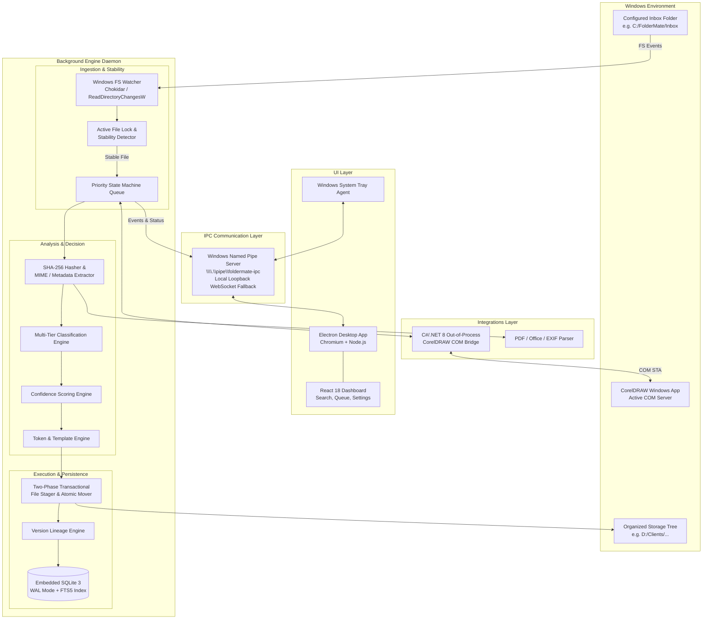
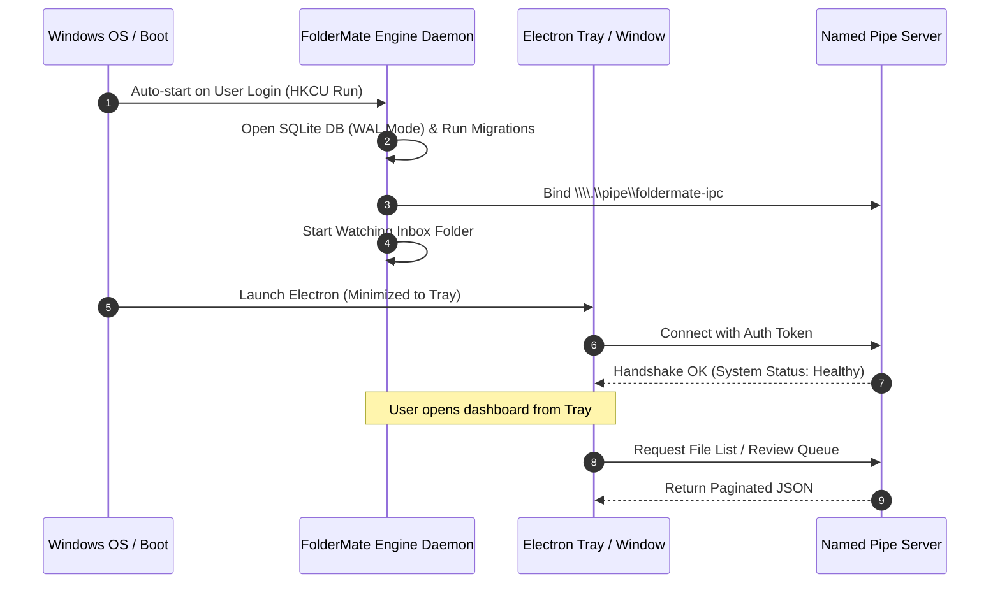
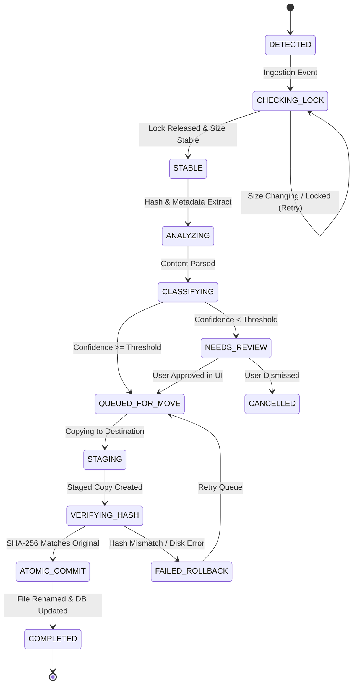

# FolderMate System Architecture

## 1. Architectural Philosophy & Core Principles

FolderMate is engineered around three non-negotiable architectural tenets:

1. **Safety First**: File data integrity is paramount. FolderMate must never corrupt, truncate, or lose user files. All filesystem operations use transactional two-phase staging with cryptographic verification.
2. **Deterministic-First Layering**: Automated classification follows strict priority tiers:
   $$\text{Deterministic Rules} \to \text{Dictionaries/Aliases} \to \text{Metadata/Content} \to \text{Heuristics} \to \text{AI Fallback}$$
   Deterministic rules always supersede speculative heuristics.
3. **Decoupled Background Execution**: The core watcher, queue, and database engine operate independently of the UI. If the user closes the Electron window, the engine runs silently in the Windows system tray with an ultralight memory footprint (<50MB).

---

## 2. High-Level Architecture Diagram



---

## 3. Process & Deployment Architecture

FolderMate operates across three distinct process boundaries to maximize stability and prevent UI freezing or engine crashes:

### 3.1. Process Topology

| Process | Executable / Runtime | Responsibility | Lifecycle | Memory Target |
| :--- | :--- | :--- | :--- | :--- |
| **Engine Daemon** | `foldermate-engine.exe` (Node.js/TypeScript packaged or background process) | Watcher, lock checks, classification, two-phase mover, SQLite DB, IPC server | Starts with Windows (Registry Run / Task Scheduler), runs 24/7 | 40MB – 60MB |
| **System Tray Agent & UI** | `foldermate.exe` (Electron main + renderer) | Dashboard, Review Queue, Rule editor, Search UI, Tray menu | Starts on boot or user launch; hides to tray on window close | 80MB – 120MB (window closed: <20MB) |
| **CorelDRAW COM Bridge** | `FolderMate.CorelBridge.exe` (C# .NET 8 CLI) | Out-of-process COM automation (`CorelDRAW.Application`), version increments, preview rendering | Ephemeral: spawned per COM task or pooled single-instance | 15MB – 25MB (while active) |



---

## 4. Subsystem Breakdown

### 4.1. Ingestion & Active Lock Detection
- **Watcher**: Listens for filesystem notifications (`create`, `change`, `rename`) via Windows `ReadDirectoryChangesW` (wrapped by `chokidar` in Node).
- **Debouncer**: Coalesces burst filesystem events per file path (configurable debounce window, default: 1500ms).
- **Stability & Lock Detector**:
  - Checks if file handle can be opened with exclusive read/write access (`CreateFileW` with `GENERIC_READ | GENERIC_WRITE`, `FILE_SHARE_NONE`).
  - Measures file size and last modification time ($t_0$ vs $t_0 + \Delta t$).
  - Once file size remains constant and no lock error occurs across two successive inspection intervals (default: 3000ms), file is marked `STABLE`.

### 4.2. File Analysis & Cryptographic Hashing
- **Hashing**: Computes `SHA-256` over the file content using streamed 64KB chunks to prevent loading large graphic files (e.g. 500MB CorelDRAW designs) into RAM.
- **MIME & Header Detection**: Inspects magic bytes (e.g. `PK\x03\x04` for CDR zip containers, `%PDF-` for PDFs, `RIFF` for webp/media) to avoid extension spoofing.
- **Metadata Extraction**: Extracts embedded document titles, page counts, author tags, and embedded thumbnails where accessible.

### 4.3. Multi-Tier Classification & Confidence Engine
The classification pipeline executes sequentially:
1. **Rule Matcher**: Evaluates user-defined conditional rules (e.g. `IF ext == 'cdr' AND name CONTAINS 'inv' THEN Category = 'Invoice'`).
2. **Client Alias Dictionary**: Scans extracted tokens against normalized client names and registered aliases using exact match and Levenshtein fuzzy distance ($\le 1$).
3. **Project Context Matcher**: Matches tokens against active projects associated with the identified client.
4. **Temporal Extractor**: Regex extraction of 4-digit years (`2020-2035`), months, and date strings.
5. **Version Parser**: Normalizes version indicators (`v1`, `v02`, `ver_3`, `final`, `latest`, `new`) into canonical integer versions.
6. **Confidence Scorer**: Calculates a weighted confidence score $C \in [0, 100]$.
   - If $C \ge 85\%$: Automatically organized (if auto-mode enabled).
   - If $60\% \le C < 85\%$: Placed in Review Queue with pre-selected recommendations.
   - If $C < 60\%$: Placed in Review Queue flagged as `Needs Manual Review`.

### 4.4. Two-Phase Safe File Organization Engine
To ensure 100% data preservation, file movement uses a two-phase staging protocol:
1. **Phase 1 (Staging & Verification)**:
   - Target directory is verified or created.
   - File is copied to `<DestinationDir>/.foldermate_staging_<hash>`.
   - The SHA-256 hash of the staged file is computed and verified against the original.
2. **Phase 2 (Atomic Finalization & State Commit)**:
   - Staged file is atomically renamed to the final normalized filename.
   - SQLite database transaction records the new file record, updates the version lineage, and logs an audit event.
   - Depending on user safety configuration:
     - **Safe Mode (Default)**: Original file in Inbox is moved to `Inbox/_Archived/` or Windows Recycle Bin.
     - **Direct Move Mode**: Original file is removed only after verified commit.

### 4.5. Version Lineage Engine
- Maintains parent-child version relationships (`v1` $\to$ `v2` $\to$ `v3`).
- Tracks hash uniqueness to avoid duplicating identical versions.
- If an existing target filename matches, automatically resolves to the next incremental version ($v_{N+1}$) or prompts the user according to configuration.

### 4.6. Search & Full-Text Indexing Engine
- Powered by SQLite FTS5 (Full-Text Search).
- Indexes `filename`, `original_filename`, `client_name`, `project_name`, `category`, `year`, `version`, `tags`, `metadata`, and extracted OCR/document text.
- Supports prefix queries (`ABC Sch*`), boolean operators (`AND`, `OR`, `NOT`), and exact phrase matching.

---

## 5. UI ↔ Engine Communication Protocol

### 5.1. Transport Mechanism
- **Primary Transport**: Windows Named Pipe (`\\.\pipe\foldermate-ipc`).
- **Fallback Transport**: Local WebSocket on loopback interface (`ws://127.0.0.1:49221`).
- **Authentication**: On daemon startup, an ephemeral 256-bit cryptographically secure token is written to `%APPDATA%\FolderMate\.auth_token` with restrictive Windows ACLs (readable only by the current Windows user). The Electron client reads this file and presents the token during handshake.

### 5.2. Message Framing & RPC Structure
Messages use JSON-RPC 2.0 framing:

```typescript
// Client Request
interface IPCRequest {
  jsonrpc: "2.0";
  id: string;
  method: string;
  params?: Record<string, unknown>;
}

// Daemon Response
interface IPCResponse {
  jsonrpc: "2.0";
  id: string;
  result?: unknown;
  error?: {
    code: number;
    message: string;
    data?: unknown;
  };
}

// Daemon Server-Sent Notification / Event
interface IPCNotification {
  jsonrpc: "2.0";
  method: "event";
  params: {
    eventType: string;
    payload: unknown;
    timestamp: string;
  };
}
```

---

## 6. Crash Recovery & Resilience State Machine

Each file in the processing pipeline transitions through a deterministic state machine recorded in SQLite:



### 6.1. Startup Recovery Protocol
When `foldermate-engine.exe` initializes:
1. It queries `files` and `review_queue` for records in intermediate states (`STAGING`, `VERIFYING_HASH`, `QUEUED_FOR_MOVE`).
2. Any orphan `.foldermate_staging_*` files in target folders are identified and cleaned up.
3. Incomplete file moves are re-evaluated against the source in the Inbox.
4. Database transactions are verified against actual filesystem state to maintain strict bidirectional synchronization.
