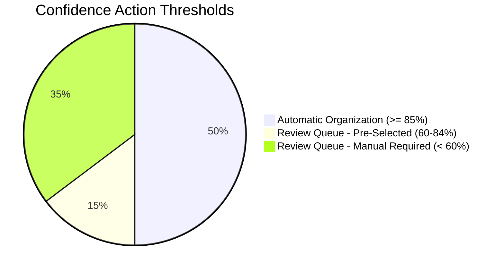
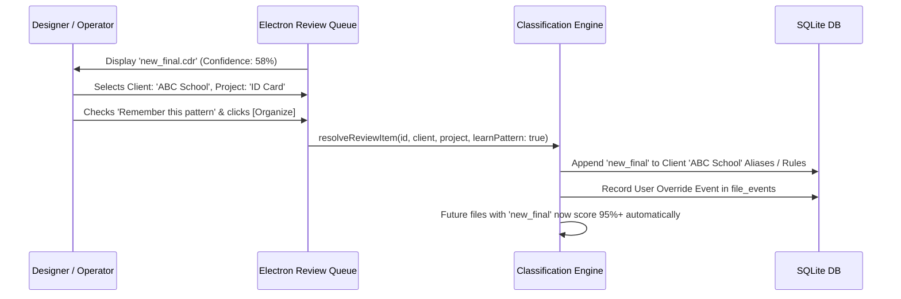

# FolderMate Multi-Tier Classification & Confidence Engine

## 1. Classification Philosophy

Classification in FolderMate is strictly **deterministic-first, heuristic-second, AI-assisted last**. 

We do not treat classification as a single monolithic black-box prompt. Instead, classification operates through a **multi-stage pipelined scoring filter**, where fast, exact deterministic rules handle 80%+ of office files, while fuzzy heuristics and OCR/AI handle messy edge cases.

---

## 2. Multi-Stage Pipeline Architecture

```mermaid
graph TD
    File[Ingested Stable File] --> Stage1[Stage 1: User-Defined Deterministic Rules]
    Stage1 -->|Rule Matched (100% Conf)| Output[Target Classification]
    Stage1 -->|No Match| Stage2[Stage 2: Client & Alias Dictionary Matching]
    
    Stage2 --> Stage3[Stage 3: Project & Campaign Context Matching]
    Stage3 --> Stage4[Stage 4: Temporal / Year Extraction]
    Stage4 --> Stage5[Stage 5: Version & Suffix Parsing]
    Stage5 --> Stage6[Stage 6: Document Metadata & Text Extraction]
    
    Stage6 --> Scorer[Composite Confidence Scorer]
    
    Scorer --> ScoreEval{Evaluate Score C}
    ScoreEval -- C >= 85% --> Auto[Automatic Organization]
    ScoreEval -- 60% <= C < 85% --> ReviewSuggested[Review Queue: High Confidence Suggestion]
    ScoreEval -- C < 60% --> ReviewManual[Review Queue: Needs Manual Selection]
```

---

## 3. Classification Stages Explained

### Stage 1: User-Defined Deterministic Rules
Custom regex and predicate trees configured by the user in `organization_rules`.
- *Example*: `IF extension == ".cdr" AND filename MATCHES /^inv_\d+/ THEN Client = "Accounts", Category = "Invoices"`
- *Confidence*: **1.0 (100%)** — Immediately bypasses heuristic scoring.

### Stage 2: Client & Alias Dictionary Matching
Scans extracted tokens against registered clients in the database:
- **Exact Name Match**: `ABC School` $\to$ Score: `1.0`
- **Client Code Match**: `ABCSCH` $\to$ Score: `1.0`
- **Configured Alias Match**: `ABC`, `ABC-School`, `ABCS` $\to$ Score: `0.95`
- **Fuzzy Levenshtein Match ($\text{distance} \le 1$)**: `ABC Scool` $\to$ Score: `0.85`
- **Acronym Generation**: Initials of multi-word clients (`ABC` for `Apple Blossom Cafe`) $\to$ Score: `0.75`

### Stage 3: Project Context Matching
Scans tokens against existing projects associated with the candidate client:
- **Exact Project Name**: `ID Card` in filename `ABC School ID Card 2026.cdr` $\to$ Score: `1.0`
- **Project Code**: `IDC2026` $\to$ Score: `0.95`
- **Fuzzy / Slug Match**: `id-card`, `idcard` $\to$ Score: `0.85`
- **Category Keyword Match**: `card`, `flyer`, `brochure`, `logo`, `banner` $\to$ Score: `0.70`

### Stage 4: Temporal / Year Extraction
- **4-Digit Year in Filename** (`2020` to `2035`): `2026` $\to$ Score: `1.0`
- **2-Digit Year with Prefix/Suffix** (`'26`, `_26`): `26` $\to$ Score: `0.80`
- **File System Creation / Modification Year Fallback**: Current year $\to$ Score: `0.60`

### Stage 5: Version Extraction
- Parsed via `VERSION_PATTERNS` (see [VERSIONING.md](file:///e:/E/FolderMate/VERSIONING.md)).

### Stage 6: Content & Metadata Extraction (When Available)
- **CorelDRAW Document Summary**: Title and keywords embedded in the CDR zip header (`metadata.xml`).
- **PDF Info Dictionary**: `/Title`, `/Author`, `/Subject`.
- **Image EXIF / OCR**: Text detected on page headers via fast local OCR.

---

## 4. Mathematical Confidence Scoring Model

The overall classification confidence $C \in [0.0, 1.0]$ is computed as a weighted sum of independent component scores, normalized by factor weights:

$$C = w_{client} \cdot S_{client} + w_{project} \cdot S_{project} + w_{year} \cdot S_{year} + w_{version} \cdot S_{version}$$

### 4.1. Standard Weight Configuration

| Component | Weight ($w_i$) | Rationale |
| :--- | :--- | :--- |
| **Client Match ($S_{client}$)** | $0.40$ (40%) | Client identification is the most critical routing factor. |
| **Project Match ($S_{project}$)** | $0.35$ (35%) | Project locates the exact subfolder. |
| **Year Match ($S_{year}$)** | $0.15$ (15%) | Year provides temporal grouping. |
| **Version Match ($S_{version}$)** | $0.10$ (10%) | Version prevents collisions. |
| **Total** | **$1.00$ (100%)** | |

### 4.2. Concrete Scoring Example

**Input Filename**: `abc id card 2026 final.cdr`

1. **Client Token (`abc`)**: Matches registered alias for `ABC School` $\to S_{client} = 0.95$
2. **Project Token (`id card`)**: Exact match for registered project `ID Card` $\to S_{project} = 1.00$
3. **Year Token (`2026`)**: 4-digit explicit regex match $\to S_{year} = 1.00$
4. **Version Token (`final`)**: Qualitative token, resolves to next DB version $\to S_{version} = 0.80$

$$\begin{aligned}
C &= (0.40 \times 0.95) + (0.35 \times 1.00) + (0.15 \times 1.00) + (0.10 \times 0.80) \\
C &= 0.380 + 0.350 + 0.150 + 0.080 = \mathbf{0.960} \text{ (96.0\% Confidence)}
\end{aligned}$$

**Result**: $96.0\% \ge 85.0\% \implies$ **Automatic Organization Executed**.

---

## 5. Decision Thresholds & Automation Modes



### 5.1. Configurable Strictness Modes

| Strictness Level | Auto Threshold | Behavior |
| :--- | :--- | :--- |
| **Cautious (Safe)** | $95\%$ | Only executes on exact client + exact project matches. |
| **Balanced (Default)** | $85\%$ | Standard office setup; auto-organizes high confidence files. |
| **Aggressive** | $70\%$ | Automatically organizes files with fuzzy or partial matches. |

---

## 6. Feedback Learning & Alias Evolution

FolderMate continuously learns from user interactions in the Review Queue:


