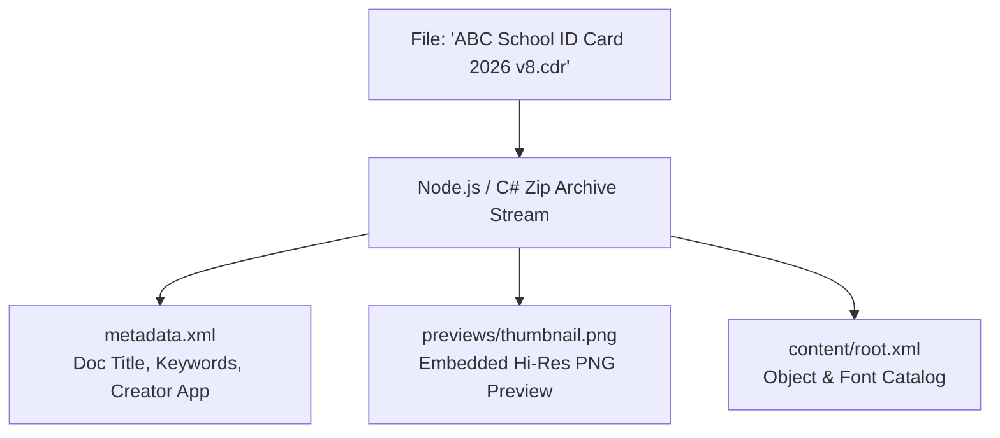

# FolderMate CorelDRAW Windows COM Integration

## 1. Integration Scope & Supported Versions

CorelDRAW is the primary vector graphics suite in printing, prepress, and sign-making environments. FolderMate provides two levels of CorelDRAW integration:

1. **Active Application Automation (via Windows COM)**: Automates live instances of CorelDRAW (2020 through 2024 / versions 22.0 through 25.0) to query active documents, trigger "Save as New Version", publish PDFs, and generate high-fidelity previews.
2. **Direct Container Inspection (Passive / Offline Fallback)**: Inspects `.cdr` files directly on disk (since CDR files are PK-Zip compressed archives) to extract embedded XML metadata and `previews/thumbnail.png` without launching CorelDRAW.

---

## 2. Out-of-Process COM Bridge Architecture

### 2.1. Why Out-of-Process Isolation is Mandatory
Windows COM automation requires Single-Threaded Apartment (STA) threading. Attempting to call COM directly inside Node.js worker threads or Electron's V8 event loop introduces major stability risks:
- If CorelDRAW hangs on a modal dialog (e.g. *Font Missing Warning* or *Color Profile Conversion*), Node's main event loop would block.
- COM apartment marshalling crashes in multithreaded V8 runtimes.
- Memory leaks in legacy COM wrappers.

**Solution**: FolderMate uses a standalone, ultra-lightweight C# .NET 8 CLI bridge (`FolderMate.CorelBridge.exe`).

```mermaid
graph LR
    Engine[FolderMate Node.js Daemon] -->|JSON CLI Call / Stdio| Bridge[FolderMate.CorelBridge.exe<br/>C# .NET 8 STA Process]
    Bridge -->|Windows COM Interop<br/>TypeLib / Dynamic| CorelApp[CorelDRAW.Application<br/>Active Running Process]
    
    Bridge -.->|Timeout / Modal Hang (10s)| Kill[Process Timeout Kill]
    Bridge -->|Return JSON Result| Engine
```

---

## 3. CorelDRAW COM Bridge CLI Interface

The CLI executable `FolderMate.CorelBridge.exe` provides a strict JSON-over-stdio protocol:

### 3.1. Command Reference

#### 1. `status`
Inspects if CorelDRAW is running and returns active document details.
```bash
FolderMate.CorelBridge.exe status
```
**JSON Output**:
```json
{
  "success": true,
  "isRunning": true,
  "version": "CorelDRAW 2024 (25.0.0.230)",
  "activeDocument": {
    "title": "ABC School ID Card 2026 v7.cdr",
    "fullPath": "D:\\Clients\\ABC School\\2026\\ID Card\\ABC School ID Card 2026 v7.cdr",
    "isDirty": true,
    "pageCount": 2,
    "unit": "Millimeters"
  }
}
```

#### 2. `save-as-new-version`
Saves the currently active document to a target path as a new version.
```bash
FolderMate.CorelBridge.exe save-as-new-version --target "D:\Clients\ABC School\2026\ID Card\ABC School ID Card 2026 v8.cdr"
```
**JSON Output**:
```json
{
  "success": true,
  "savedPath": "D:\\Clients\\ABC School\\2026\\ID Card\\ABC School ID Card 2026 v8.cdr",
  "fileSizeBytes": 1542890
}
```

#### 3. `export-pdf`
Publishes the active or specified CDR file to PDF using prepress export presets.
```bash
FolderMate.CorelBridge.exe export-pdf --source "D:\...\v8.cdr" --target "D:\...\v8.pdf" --preset "Prepress"
```

#### 4. `export-preview`
Exports a high-resolution PNG rendering of the active document page.
```bash
FolderMate.CorelBridge.exe export-preview --source "D:\...\v8.cdr" --target "D:\...\preview.png" --width 1200
```

---

## 4. C# COM Bridge Implementation Blueprint

```csharp
using System;
using System.IO;
using System.Runtime.InteropServices;
using System.Text.Json;

namespace FolderMate.CorelBridge
{
    class Program
    {
        [STAThread]
        static int Main(string[] args)
        {
            if (args.Length == 0)
            {
                Console.WriteLine(JsonSerializer.Serialize(new { success = false, error = "No command provided" }));
                return 1;
            }

            string command = args[0].ToLowerInvariant();

            try
            {
                switch (command)
                {
                    case "status":
                        return HandleStatus();
                    case "save-as-new-version":
                        return HandleSaveAs(args);
                    default:
                        Console.WriteLine(JsonSerializer.Serialize(new { success = false, error = "Unknown command" }));
                        return 1;
                }
            }
            catch (Exception ex)
            {
                Console.WriteLine(JsonSerializer.Serialize(new { success = false, error = ex.Message, stack = ex.StackTrace }));
                return 1;
            }
        }

        static int HandleStatus()
        {
            dynamic corelApp = null;
            try
            {
                // Attempt binding to active running instance
                corelApp = Marshal.GetActiveObject("CorelDRAW.Application");
            }
            catch (COMException)
            {
                Console.WriteLine(JsonSerializer.Serialize(new { success = true, isRunning = false }));
                return 0;
            }

            try
            {
                dynamic doc = corelApp.ActiveDocument;
                if (doc == null)
                {
                    Console.WriteLine(JsonSerializer.Serialize(new { success = true, isRunning = true, activeDocument = (object)null }));
                    return 0;
                }

                var status = new
                {
                    success = true,
                    isRunning = true,
                    version = (string)corelApp.Version,
                    activeDocument = new
                    {
                        title = (string)doc.Name,
                        fullPath = (string)doc.FullFileName,
                        isDirty = (bool)doc.Dirty,
                        pageCount = (int)doc.Pages.Count
                    }
                };

                Console.WriteLine(JsonSerializer.Serialize(status));
                return 0;
            }
            finally
            {
                if (corelApp != null)
                {
                    Marshal.ReleaseComObject(corelApp);
                }
            }
        }

        static int HandleSaveAs(string[] args)
        {
            // Parse arguments and execute ActiveDocument.SaveAs(targetPath)
            // Implementation with proper COM cleanup
            return 0;
        }
    }
}
```

---

## 5. Direct Passive CDR Inspection (Offline / No CorelDRAW)

Because modern CorelDRAW `.cdr` files (CorelDRAW X4 / v14 through 2024) use standard ZIP container packaging, FolderMate can inspect files without launching CorelDRAW:



### 5.1. Extraction Benefits
- **Zero CPU/RAM overhead**: Inspects 100MB files in $<15\text{ms}$.
- **Background indexing**: Works silently on headless servers or when CorelDRAW is closed.
- **Thumbnail generation**: Extracts instant UI thumbnails without launching graphic editors.

---

## 6. COM Fault Handling & Modal Dialog Recovery

| Failure Mode | Detection | Mitigation |
| :--- | :--- | :--- |
| **CorelDRAW modal dialog blocking COM** | Bridge call hangs $>10$ seconds | C# process watchdog kills bridge with timeout error code; informs user: *"Please close the dialog in CorelDRAW to continue"*. |
| **CorelDRAW crashed or unresponsive** | `RPC_E_SERVERFAULT` / `CO_E_SERVER_EXEC_FAILURE` | Catch COM exception; release COM pointers; mark Corel status as `Disconnected`. |
| **File locked by CorelDRAW background autosave** | `HRESULT 0x80004005` (E_FAIL) | Retry with 1500ms exponential backoff up to 3 times. |
