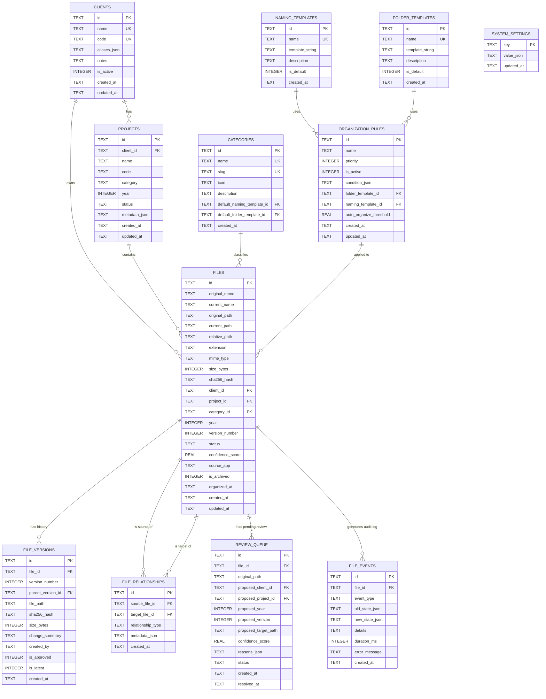

# FolderMate Database Architecture & Schema

## 1. Database Evaluation & Selection

FolderMate utilizes **SQLite 3 with Write-Ahead Logging (WAL) Mode** and **FTS5 (Full-Text Search)** via the high-performance `better-sqlite3` native Node.js driver.

### 1.1. Technology Evaluation Matrix

| Criteria | SQLite 3 (WAL + FTS5) | SQLCipher | DuckDB | Embedded PostgreSQL |
| :--- | :--- | :--- | :--- | :--- |
| **Reliability & ACID** | ⭐⭐⭐⭐⭐ Zero corruption track record | ⭐⭐⭐⭐⭐ Industrial grade | ⭐⭐⭐⭐ Optimized for OLAP | ⭐⭐⭐ Complex local daemon |
| **Concurrency** | ⭐⭐⭐⭐⭐ Unlimited concurrent readers + 1 writer in WAL | ⭐⭐⭐⭐ Slightly higher IO cost | ⭐⭐⭐ Concurrent read, table lock write | ⭐⭐⭐⭐⭐ Multi-process |
| **Performance** | ⭐⭐⭐⭐⭐ <0.5ms queries; in-process memory | ⭐⭐⭐⭐ ~5-10% crypto overhead | ⭐⭐⭐⭐⭐ Fast vector/analytics | ⭐⭐⭐ Inter-process overhead |
| **Windows Compatibility** | ⭐⭐⭐⭐⭐ Native Windows C library | ⭐⭐⭐⭐ Requires OpenSSL bindings | ⭐⭐⭐⭐ Large binary footprint | ⭐⭐ Large installer overhead (>100MB) |
| **Search Capabilities** | ⭐⭐⭐⭐⭐ Native FTS5 with BM25 ranking | ⭐⭐⭐⭐ FTS5 supported | ⭐⭐⭐ Full-text extensions | ⭐⭐⭐⭐⭐ Rich FTS |
| **Binary Footprint** | ⭐⭐⭐⭐⭐ <5MB included in binary | ⭐⭐⭐⭐ ~8MB | ⭐⭐ ~40MB | ❌ >150MB |
| **Selection** | **SELECTED (Default Engine)** | **Future Option (Encrypted edition)** | Rejected | Rejected |

### 1.2. PRAGMA Configuration for High Reliability
Upon establishing a connection, the engine executes:

```sql
PRAGMA journal_mode = WAL;            -- Concurrent readers + writer without blocking
PRAGMA synchronous = NORMAL;          -- Optimal durability/speed trade-off in WAL mode
PRAGMA foreign_keys = ON;             -- Enforce relational integrity constraints
PRAGMA cache_size = -64000;           -- 64MB in-memory page cache
PRAGMA temp_store = MEMORY;           -- Keep temp tables and sorting structures in RAM
PRAGMA mmap_size = 268435456;         -- 256MB memory-mapped I/O for lightning-fast reads
PRAGMA busy_timeout = 5000;           -- 5 second wait for lock contention resolution
```

---

## 2. Entity-Relationship (ER) Diagram



---

## 3. Detailed Table Specifications & DDL

### 3.1. `clients`
Stores registered clients, business entities, and fuzzy aliases used for classification.

```sql
CREATE TABLE IF NOT EXISTS clients (
    id TEXT PRIMARY KEY,                       -- UUID v4
    name TEXT NOT NULL COLLATE NOCASE,         -- e.g. "ABC School"
    code TEXT NOT NULL COLLATE NOCASE,         -- e.g. "ABCSCH"
    aliases_json TEXT NOT NULL DEFAULT '[]',   -- JSON array: ["ABC", "ABC School", "ABC-School", "ABCS"]
    notes TEXT,                                -- User notes
    is_active INTEGER NOT NULL DEFAULT 1,      -- 1 = Active, 0 = Inactive/Archived
    created_at TEXT NOT NULL DEFAULT (strftime('%Y-%m-%dT%H:%M:%fZ', 'now')),
    updated_at TEXT NOT NULL DEFAULT (strftime('%Y-%m-%dT%H:%M:%fZ', 'now'))
);

CREATE UNIQUE INDEX IF NOT EXISTS idx_clients_name ON clients(name);
CREATE UNIQUE INDEX IF NOT EXISTS idx_clients_code ON clients(code);
CREATE INDEX IF NOT EXISTS idx_clients_active ON clients(is_active);
```

### 3.2. `projects`
Stores client projects, campaign groupings, and year associations.

```sql
CREATE TABLE IF NOT EXISTS projects (
    id TEXT PRIMARY KEY,
    client_id TEXT NOT NULL REFERENCES clients(id) ON DELETE CASCADE,
    name TEXT NOT NULL COLLATE NOCASE,         -- e.g. "ID Card"
    code TEXT COLLATE NOCASE,                  -- e.g. "IDC2026"
    category TEXT DEFAULT 'General',           -- e.g. "Design", "Print", "Branding"
    year INTEGER NOT NULL,                     -- e.g. 2026
    status TEXT NOT NULL DEFAULT 'active',     -- 'active', 'completed', 'archived'
    metadata_json TEXT DEFAULT '{}',           -- Arbitrary key-value metadata
    created_at TEXT NOT NULL DEFAULT (strftime('%Y-%m-%dT%H:%M:%fZ', 'now')),
    updated_at TEXT NOT NULL DEFAULT (strftime('%Y-%m-%dT%H:%M:%fZ', 'now')),
    UNIQUE(client_id, name, year)
);

CREATE INDEX IF NOT EXISTS idx_projects_client_year ON projects(client_id, year);
CREATE INDEX IF NOT EXISTS idx_projects_status ON projects(status);
```

### 3.3. `categories`
Top-level category buckets (e.g. Identity, Marketing, Stationery, Prepress).

```sql
CREATE TABLE IF NOT EXISTS categories (
    id TEXT PRIMARY KEY,
    name TEXT NOT NULL UNIQUE COLLATE NOCASE,
    slug TEXT NOT NULL UNIQUE,
    icon TEXT DEFAULT 'folder',
    description TEXT,
    default_naming_template_id TEXT,
    default_folder_template_id TEXT,
    created_at TEXT NOT NULL DEFAULT (strftime('%Y-%m-%dT%H:%M:%fZ', 'now'))
);
```

### 3.4. `files`
The core ledger of all tracked and organized files.

```sql
CREATE TABLE IF NOT EXISTS files (
    id TEXT PRIMARY KEY,
    original_name TEXT NOT NULL,               -- e.g. "abc new final.cdr"
    current_name TEXT NOT NULL,                -- e.g. "ABC School ID Card 2026 v8.cdr"
    original_path TEXT NOT NULL,               -- Full original absolute path
    current_path TEXT NOT NULL,                -- Full current organized absolute path
    relative_path TEXT NOT NULL,               -- Path relative to Organization Root
    extension TEXT NOT NULL COLLATE NOCASE,    -- e.g. ".cdr", ".pdf"
    mime_type TEXT NOT NULL,                   -- e.g. "application/vnd.corel-draw", "application/pdf"
    size_bytes INTEGER NOT NULL,               -- File size in bytes
    sha256_hash TEXT NOT NULL,                 -- Cryptographic SHA-256
    client_id TEXT REFERENCES clients(id) ON DELETE SET NULL,
    project_id TEXT REFERENCES projects(id) ON DELETE SET NULL,
    category_id TEXT REFERENCES categories(id) ON DELETE SET NULL,
    year INTEGER,                              -- e.g. 2026
    version_number INTEGER NOT NULL DEFAULT 1, -- Integer version (e.g. 8 for v8)
    status TEXT NOT NULL DEFAULT 'organized',  -- 'detected', 'staged', 'organized', 'needs_review', 'archived', 'trashed'
    confidence_score REAL NOT NULL DEFAULT 1.0,-- 0.0 to 1.0 (or 0 to 100)
    source_app TEXT,                           -- e.g. "CorelDRAW 2024", "Adobe Illustrator", "Unknown"
    is_archived INTEGER NOT NULL DEFAULT 0,    -- 0 = False, 1 = True
    organized_at TEXT,
    created_at TEXT NOT NULL DEFAULT (strftime('%Y-%m-%dT%H:%M:%fZ', 'now')),
    updated_at TEXT NOT NULL DEFAULT (strftime('%Y-%m-%dT%H:%M:%fZ', 'now'))
);

CREATE INDEX IF NOT EXISTS idx_files_hash ON files(sha256_hash);
CREATE INDEX IF NOT EXISTS idx_files_client_project ON files(client_id, project_id);
CREATE INDEX IF NOT EXISTS idx_files_status ON files(status);
CREATE INDEX IF NOT EXISTS idx_files_extension ON files(extension);
CREATE INDEX IF NOT EXISTS idx_files_created ON files(created_at DESC);
CREATE INDEX IF NOT EXISTS idx_files_current_path ON files(current_path);
```

### 3.5. `file_versions`
Tracks the complete historical progression of versions for each managed file.

```sql
CREATE TABLE IF NOT EXISTS file_versions (
    id TEXT PRIMARY KEY,
    file_id TEXT NOT NULL REFERENCES files(id) ON DELETE CASCADE,
    version_number INTEGER NOT NULL,           -- e.g. 1, 2, 3...
    parent_version_id TEXT REFERENCES file_versions(id) ON DELETE SET NULL,
    file_path TEXT NOT NULL,                   -- Path to this specific version copy
    sha256_hash TEXT NOT NULL,                 -- Hash of this version
    size_bytes INTEGER NOT NULL,
    change_summary TEXT,                       -- User comment or automated changelog
    created_by TEXT DEFAULT 'user',            -- 'user', 'coreldraw_integration', 'auto_rule'
    is_approved INTEGER NOT NULL DEFAULT 0,    -- 1 = Marked as Approved / Ready for Print
    is_latest INTEGER NOT NULL DEFAULT 1,      -- 1 = Current active version, 0 = Historical
    created_at TEXT NOT NULL DEFAULT (strftime('%Y-%m-%dT%H:%M:%fZ', 'now')),
    UNIQUE(file_id, version_number)
);

CREATE INDEX IF NOT EXISTS idx_versions_file_latest ON file_versions(file_id, is_latest);
CREATE INDEX IF NOT EXISTS idx_versions_hash ON file_versions(sha256_hash);
```

### 3.6. `file_relationships`
Captures multi-file lineage and derivation graphs (e.g. CDR design $\to$ exported PDF $\to$ preview PNG).

```sql
CREATE TABLE IF NOT EXISTS file_relationships (
    id TEXT PRIMARY KEY,
    source_file_id TEXT NOT NULL REFERENCES files(id) ON DELETE CASCADE,
    target_file_id TEXT NOT NULL REFERENCES files(id) ON DELETE CASCADE,
    relationship_type TEXT NOT NULL,           -- 'exported_to', 'preview_of', 'asset_for', 'duplicate_of'
    metadata_json TEXT DEFAULT '{}',
    created_at TEXT NOT NULL DEFAULT (strftime('%Y-%m-%dT%H:%M:%fZ', 'now')),
    UNIQUE(source_file_id, target_file_id, relationship_type)
);

CREATE INDEX IF NOT EXISTS idx_rel_source ON file_relationships(source_file_id);
CREATE INDEX IF NOT EXISTS idx_rel_target ON file_relationships(target_file_id);
```

### 3.7. `naming_templates` & `folder_templates`
Stores user-configurable string templates with token expansion markers.

```sql
CREATE TABLE IF NOT EXISTS naming_templates (
    id TEXT PRIMARY KEY,
    name TEXT NOT NULL UNIQUE,                 -- e.g. "Standard Design Naming"
    template_string TEXT NOT NULL,             -- e.g. "{Client} {Project} {Year} v{Version}"
    description TEXT,
    is_default INTEGER NOT NULL DEFAULT 0,
    created_at TEXT NOT NULL DEFAULT (strftime('%Y-%m-%dT%H:%M:%fZ', 'now'))
);

CREATE TABLE IF NOT EXISTS folder_templates (
    id TEXT PRIMARY KEY,
    name TEXT NOT NULL UNIQUE,                 -- e.g. "Client-Year-Project Hierarchy"
    template_string TEXT NOT NULL,             -- e.g. "Clients/{Client}/{Year}/{Project}"
    description TEXT,
    is_default INTEGER NOT NULL DEFAULT 0,
    created_at TEXT NOT NULL DEFAULT (strftime('%Y-%m-%dT%H:%M:%fZ', 'now'))
);
```

### 3.8. `organization_rules`
Rule engine definitions that map file patterns to templates and target destinations.

```sql
CREATE TABLE IF NOT EXISTS organization_rules (
    id TEXT PRIMARY KEY,
    name TEXT NOT NULL,
    priority INTEGER NOT NULL DEFAULT 100,     -- Lower number = higher evaluation priority
    is_active INTEGER NOT NULL DEFAULT 1,
    condition_json TEXT NOT NULL,              -- JSON predicate tree (extensions, keywords, regex)
    folder_template_id TEXT REFERENCES folder_templates(id),
    naming_template_id TEXT REFERENCES naming_templates(id),
    auto_organize_threshold REAL DEFAULT 0.85, -- Minimum confidence for auto-execution
    created_at TEXT NOT NULL DEFAULT (strftime('%Y-%m-%dT%H:%M:%fZ', 'now')),
    updated_at TEXT NOT NULL DEFAULT (strftime('%Y-%m-%dT%H:%M:%fZ', 'now'))
);

CREATE INDEX IF NOT EXISTS idx_rules_priority ON organization_rules(priority, is_active);
```

### 3.9. `review_queue`
Holds ambiguous or low-confidence files pending human decision in the Electron UI.

```sql
CREATE TABLE IF NOT EXISTS review_queue (
    id TEXT PRIMARY KEY,
    file_id TEXT REFERENCES files(id) ON DELETE CASCADE,
    original_path TEXT NOT NULL,
    proposed_client_id TEXT REFERENCES clients(id) ON DELETE SET NULL,
    proposed_project_id TEXT REFERENCES projects(id) ON DELETE SET NULL,
    proposed_year INTEGER,
    proposed_version INTEGER DEFAULT 1,
    proposed_target_path TEXT,
    confidence_score REAL NOT NULL,            -- e.g. 0.65
    reasons_json TEXT NOT NULL DEFAULT '[]',   -- Breakdown of confidence factors
    status TEXT NOT NULL DEFAULT 'pending',    -- 'pending', 'resolved', 'ignored'
    created_at TEXT NOT NULL DEFAULT (strftime('%Y-%m-%dT%H:%M:%fZ', 'now')),
    resolved_at TEXT
);

CREATE INDEX IF NOT EXISTS idx_review_queue_status ON review_queue(status, created_at DESC);
```

### 3.10. `file_events` (Audit & History Ledger)
Complete append-only audit trail of every operation performed by FolderMate.

```sql
CREATE TABLE IF NOT EXISTS file_events (
    id TEXT PRIMARY KEY,
    file_id TEXT REFERENCES files(id) ON DELETE SET NULL,
    event_type TEXT NOT NULL,                  -- 'DETECTED', 'CLASSIFIED', 'STAGED', 'ORGANIZED', 'VERSION_INCREMENTED', 'RESTORED', 'ERROR'
    old_state_json TEXT,
    new_state_json TEXT,
    details TEXT,
    duration_ms INTEGER,
    error_message TEXT,
    created_at TEXT NOT NULL DEFAULT (strftime('%Y-%m-%dT%H:%M:%fZ', 'now'))
);

CREATE INDEX IF NOT EXISTS idx_events_file_id ON file_events(file_id, created_at DESC);
CREATE INDEX IF NOT EXISTS idx_events_type ON file_events(event_type);
```

### 3.11. `system_settings`
Key-value configuration store with JSON-serialized values.

```sql
CREATE TABLE IF NOT EXISTS system_settings (
    key TEXT PRIMARY KEY,
    value_json TEXT NOT NULL,
    updated_at TEXT NOT NULL DEFAULT (strftime('%Y-%m-%dT%H:%M:%fZ', 'now'))
);
```

---

## 4. Full-Text Search (FTS5) Engine

To deliver instantaneous (<2ms) search across 100,000+ files, FolderMate maintains an embedded FTS5 virtual table synchronized via SQLite triggers.

```sql
-- Create Virtual FTS5 Index Table
CREATE VIRTUAL TABLE IF NOT EXISTS files_fts USING fts5(
    file_id UNINDEXED,
    filename,
    original_filename,
    client_name,
    project_name,
    category_name,
    year UNINDEXED,
    version UNINDEXED,
    tags,
    content_text,
    tokenize = 'unicode61 remove_diacritics 2'
);

-- Trigger: Synchronize on File Insert/Update
CREATE TRIGGER IF NOT EXISTS trg_files_fts_insert AFTER INSERT ON files
BEGIN
    INSERT INTO files_fts(file_id, filename, original_filename, client_name, project_name, category_name, year, version, tags, content_text)
    VALUES (
        NEW.id,
        NEW.current_name,
        NEW.original_name,
        COALESCE((SELECT name FROM clients WHERE id = NEW.client_id), ''),
        COALESCE((SELECT name FROM projects WHERE id = NEW.project_id), ''),
        COALESCE((SELECT name FROM categories WHERE id = NEW.category_id), ''),
        NEW.year,
        NEW.version_number,
        '',
        ''
    );
END;

CREATE TRIGGER IF NOT EXISTS trg_files_fts_update AFTER UPDATE ON files
BEGIN
    DELETE FROM files_fts WHERE file_id = OLD.id;
    INSERT INTO files_fts(file_id, filename, original_filename, client_name, project_name, category_name, year, version, tags, content_text)
    VALUES (
        NEW.id,
        NEW.current_name,
        NEW.original_name,
        COALESCE((SELECT name FROM clients WHERE id = NEW.client_id), ''),
        COALESCE((SELECT name FROM projects WHERE id = NEW.project_id), ''),
        COALESCE((SELECT name FROM categories WHERE id = NEW.category_id), ''),
        NEW.year,
        NEW.version_number,
        '',
        ''
    );
END;

CREATE TRIGGER IF NOT EXISTS trg_files_fts_delete AFTER DELETE ON files
BEGIN
    DELETE FROM files_fts WHERE file_id = OLD.id;
END;
```

---

## 5. Migration Strategy & Automated Snapshots

1. **Version Tracking**: A `schema_migrations` table records applied migration scripts (`001_initial_schema.sql`, `002_add_fts5.sql`, etc.).
2. **Transaction Isolation**: Each migration script executes within an explicit SQLite `BEGIN EXCLUSIVE` transaction block. If any statement fails, the database automatically rolls back.
3. **Automated Daily Backups**: The daemon uses SQLite's online backup API (`better-sqlite3.backup()`) every 24 hours at 03:00 AM (or on daemon start) to save a clean snapshot to `%APPDATA%\FolderMate\backups\foldermate_YYYY-MM-DD.db`, maintaining a rolling 7-day backup window.
