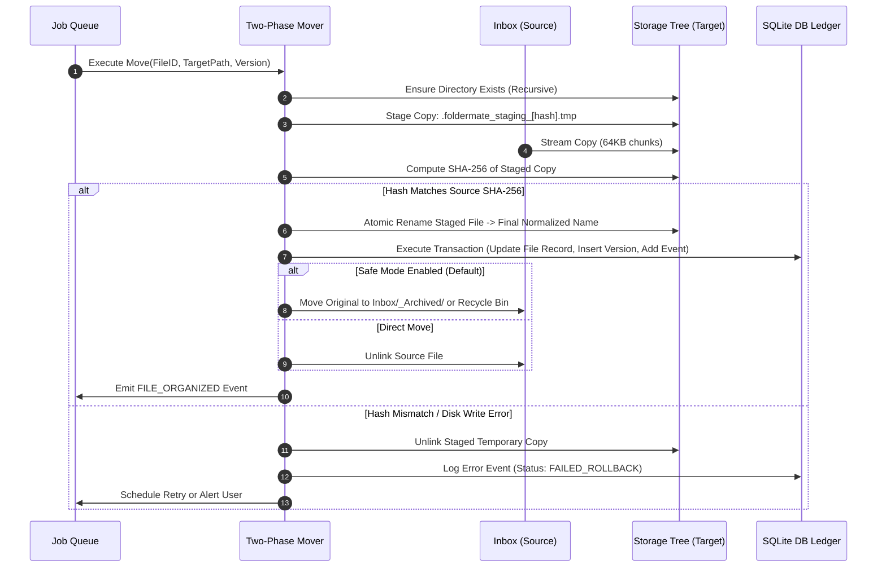

# FolderMate Safe File Operations & Organization Engine

## 1. Safety-First Philosophy

In office and graphic design workflows, files represent hours of irreplaceable human work. FolderMate adheres to a zero-data-loss guarantee:
1. **Never perform in-place destructive renames or moves** across filesystem boundaries without staging.
2. **Never touch a file while it is actively being saved or written** by CorelDRAW, Adobe Illustrator, Photoshop, or Office.
3. **Always verify cryptographic integrity** before removing or recycling the original file.
4. **All operations are recoverable and audited** in the SQLite transaction ledger.

---

## 2. Active File Lock & Stability Detection

Design software often saves files in multi-stage streams, writing partial bytes or temporary swap files before finalizing. Attempting to organize a file mid-save causes corruption.

```mermaid
flowchart TD
    Detect[File Created / Changed in Inbox] --> FilterIgnored{Is Temp / Autosave / Swap?}
    FilterIgnored -- Yes --> Drop[Ignore & Suppress]
    FilterIgnored -- No --> Debounce[Debounce FS Event 1500ms]
    
    Debounce --> Check1[Inspection Phase 1: Size S1 & mtime T1]
    Check1 --> TryLock[Test Exclusive File Handle<br/>GENERIC_READ | FILE_SHARE_NONE]
    
    TryLock -- Lock Failed / Sharing Violation --> WaitLock[Wait Stability Interval: 2500ms] --> Check1
    TryLock -- Lock Acquired --> Wait[Wait Stability Interval: 2500ms]
    
    Wait --> Check2[Inspection Phase 2: Size S2 & mtime T2]
    Check2 --> Compare{S1 == S2 AND T1 == T2?}
    
    Compare -- No (File is growing/changing) --> Check1
    Compare -- Yes --> Hash[Stream 64KB Chunks & Compute SHA-256]
    Hash --> MarkStable[Mark File STABLE -> Enqueue for Analysis]
```

### 2.1. File Exclusion Patterns
FolderMate's file watcher immediately ignores system, temporary, and lock files:

```typescript
export const IGNORED_FILE_PATTERNS = [
  // Windows Office temporary lock files
  /^~\$.*/i,
  // Generic temporary files
  /\.tmp$/i,
  /\.crswap$/i,
  /\.part$/i,
  /\.partial$/i,
  /\.download$/i,
  // CorelDRAW autosave & lock files
  /^@.*\.cdr$/i,
  /.*\.autosave\.cdr$/i,
  /.*_auto_backup\.cdr$/i,
  // Adobe temporary lock files
  /\.idlk$/i,
  /\.lock$/i,
  // Windows system metadata files
  /^Thumbs\.db$/i,
  /^desktop\.ini$/i,
  // FolderMate internal staging files
  /^\.foldermate_.*/i,
];
```

### 2.2. Windows Exclusive Lock Detection Algorithm
The engine verifies file stability using the Windows native file handle check:

```typescript
import fs from "fs";

export async function isFileLocked(filePath: string): Promise<boolean> {
  return new Promise((resolve) => {
    // Attempt opening with 'r+' (read-write) or exclusive read flags
    fs.open(filePath, "r+", (err, fd) => {
      if (err) {
        // EBUSY, EPERM, or EACCES indicates another process has an exclusive write lock
        if (["EBUSY", "EPERM", "EACCES"].includes(err.code || "")) {
          return resolve(true);
        }
      }
      if (fd !== undefined) {
        fs.close(fd, () => resolve(false));
      } else {
        resolve(false);
      }
    });
  });
}
```

---

## 3. Two-Phase Transactional Staging & Move Pipeline

FolderMate executes file moves in two distinct phases:



### 3.1. Phase 1: Staging & Cryptographic Verification
1. Verify free disk space on destination volume: `requiredSpace = fileSize * 1.05`.
2. Construct staging path: `<TargetFolder>/.foldermate_staging_<sha256>.tmp`.
3. Stream bytes from source to staging path.
4. Calculate SHA-256 hash of the staged file.
5. If `hash(staged) !== hash(source)`, immediately delete the staged file and throw a `HASH_MISMATCH` exception.

### 3.2. Phase 2: Atomic Finalization & DB Commit
1. Execute an atomic filesystem rename from `.foldermate_staging_<sha256>.tmp` to the resolved target filename (e.g. `ABC School ID Card 2026 v8.cdr`).
2. Within an immediate SQLite transaction:
   - Insert/Update the row in `files`.
   - Insert new historical version in `file_versions`.
   - Append audit record to `file_events`.
3. Handle source file cleanup:
   - In **Safe Mode (Default)**: Move source file to `Inbox/_Archived/` or Windows Recycle Bin.
   - In **Move Mode**: Delete source file only after DB transaction commits.

---

## 4. Windows Path & Filename Sanitization

FolderMate enforces strict Windows NTFS/ReFS naming compliance and supports extended-length paths.

### 4.1. Reserved Character & Name Sanitization

```typescript
// Illegal Windows filename characters: < > : " / \ | ? * and control chars (0-31)
const ILLEGAL_CHARS_REGEX = /[<>:"/\\|?*\x00-\x1F]/g;

// Reserved Windows device filenames
const RESERVED_NAMES = /^(CON|PRN|AUX|NUL|COM[1-9]|LPT[1-9])(\..*)?$/i;

export function sanitizeWindowsFilename(input: string, replacement: string = "-"): string {
  let clean = input.replace(ILLEGAL_CHARS_REGEX, replacement);
  // Trim trailing periods and spaces which are illegal in Windows Explorer
  clean = clean.replace(/[. ]+$/, "").trim();
  
  if (RESERVED_NAMES.test(clean) || clean.length === 0) {
    clean = `_${clean}`;
  }
  
  return clean;
}
```

### 4.2. Extended Path Support (`\\?\`)
Standard Windows Win32 APIs are limited to `MAX_PATH` (260 characters). FolderMate prefixes all absolute paths with the Win32 extended path prefix (`\\?\` or `\\?\UNC\`) when interacting with low-level Node.js / C# filesystem APIs:

```typescript
export function toExtendedWindowsPath(absolutePath: string): string {
  if (process.platform !== "win32") return absolutePath;
  if (absolutePath.startsWith("\\\\?\\")) return absolutePath;
  
  // Handle UNC paths: \\server\share -> \\?\UNC\server\share
  if (absolutePath.startsWith("\\\\")) {
    return `\\\\?\\UNC\\${absolutePath.slice(2)}`;
  }
  return `\\\\?\\${absolutePath}`;
}
```

---

## 5. Rollback & Fault Recovery Matrix

| Fault Scenario | Detection Point | Recovery & Rollback Action |
| :--- | :--- | :--- |
| **Disk full during staging** | `ENOSPC` during stream copy | Unlink staging file; flag file as `ERROR_DISK_FULL`; original remains untouched in Inbox. |
| **Source file deleted during copy** | `ENOENT` on source stream | Abort staging; delete partial temp file; emit `SOURCE_DISAPPEARED` event. |
| **Target filename already exists** | Destination file check | Calculate next version ($v_{N+1}$) or generate collision suffix (`(Copy 1)`). Never overwrite. |
| **Power loss / crash mid-operation** | Engine restart recovery scan | Inspect `.foldermate_staging_*` files; compare hashes with DB; clean orphaned staging files. |
| **Permission denied on target folder** | `EACCES` / `EPERM` | Retry with backoff; if persistent, move to Review Queue with `PERMISSION_DENIED` notice. |
