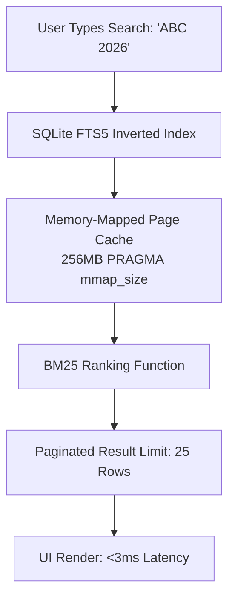
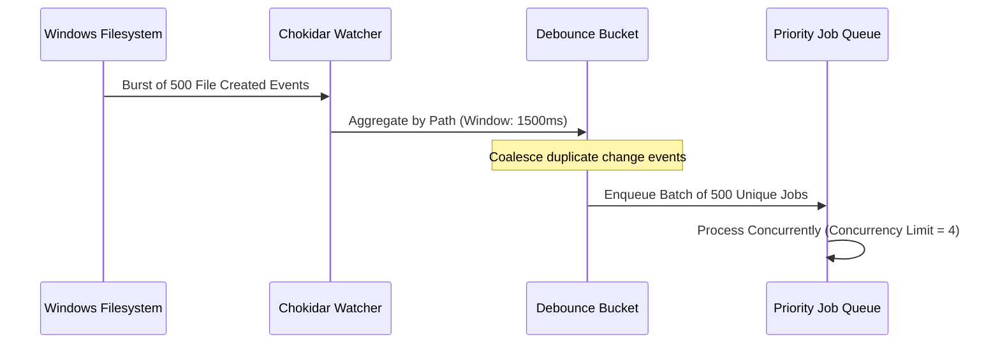

# FolderMate Performance & Scalability Engineering

## 1. Resource Budgets & Engineering Targets

FolderMate is designed as an unobtrusive, 24/7 background companion. It must never degrade system performance or cause UI lag during intensive design work.

| Metric | Target Budget | Enforcement Mechanism |
| :--- | :--- | :--- |
| **Engine Daemon Idle Memory** | $< 50\text{ MB}$ RSS | Node.js lightweight background process with minimal runtime dependencies |
| **Engine Daemon Active Memory** | $< 90\text{ MB}$ RSS | Streamed 64KB chunked I/O; no file buffering into RAM |
| **Idle CPU Utilization** | $< 0.5\%$ | Native Windows OS event-driven filesystem monitoring (`ReadDirectoryChangesW`) |
| **Search Query Latency** | $< 5\text{ ms}$ for 100k files | SQLite FTS5 with BM25 inverted index in memory-mapped pages |
| **File Lock Stability Overhead** | $< 1\text{ ms}$ per probe | Non-blocking `fs.open()` / native Win32 handle interrogation |
| **Electron UI Window Closed** | $< 20\text{ MB}$ | Renderer process suspended/destroyed when minimized to tray |

---

## 2. Memory-Safe Chunked Hashing for Large Assets

Graphic design files (CorelDRAW `.cdr`, Photoshop `.psd`, high-res print PDFs) often exceed several gigabytes. Buffering entire files into memory causes garbage collection spikes and out-of-memory crashes.

FolderMate streams data in **64KB chunks** directly through the Node.js `crypto.createHash('sha256')` pipeline:

```typescript
import fs from "fs";
import crypto from "crypto";

export async function computeFileHashStreaming(filePath: string): Promise<string> {
  return new Promise((resolve, reject) => {
    const hash = crypto.createHash("sha256");
    const stream = fs.createReadStream(filePath, { highWaterMark: 64 * 1024 });

    stream.on("data", (chunk) => hash.update(chunk));
    stream.on("end", () => resolve(hash.digest("hex")));
    stream.on("error", (err) => reject(err));
  });
}
```

---

## 3. High-Scale File Collection Handling (100k+ Files)

To scale seamlessly to large enterprise archives (100,000+ indexed files and versions):



### 3.1. SQLite Optimization Matrix
- **`PRAGMA mmap_size = 268435456`**: Enables direct 256MB memory mapping of the database file on Windows, avoiding kernel context-switching during index traversal.
- **`PRAGMA cache_size = -64000`**: Allocates 64MB of dedicated RAM for SQLite's B-Tree cache.
- **`Covering Indexes`**: Compound indexes (`idx_files_client_project`, `idx_files_hash`) allow common queries to be answered entirely from the index without table lookups.
- **`Trigger-Based FTS Sync`**: Full-text search updates happen asynchronously via SQLite triggers, guaranteeing instant consistency with zero application-level sync overhead.

---

## 4. I/O Debouncing & Throttle Control

When a user copies a folder containing 500 files into the Inbox, hundreds of filesystem events fire in milliseconds.



### 4.1. Concurrency Throttling
- File analysis and cryptographic hashing are throttled to a maximum concurrency of **4 simultaneous workers** (or `Math.min(os.cpus().length, 4)`) to prevent disk I/O saturation on mechanical hard drives or networked storage.
