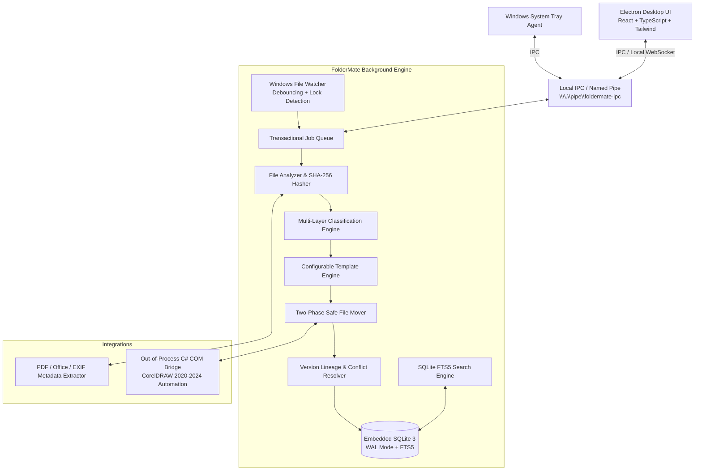

# FolderMate

> **Your files organize themselves.**

FolderMate is an intelligent, background-first Windows desktop application that automates file classification, versioning, standardized renaming, and folder organization. Designed specifically for office, design, print, and prepress workflows, FolderMate eliminates messy filenames (like `final.cdr`, `id card new.cdr`, `abc final latest.pdf`) by understanding context, assigning client/project metadata, and organizing files into clean, predictable directories.

---

## 🎯 The Core Problem & Vision

In high-volume design and office environments, users save dozens of work-in-progress files daily into arbitrary folders with inconsistent naming:
- `abc new final.cdr`
- `id card latest v2.cdr`
- `flyer final print ok.pdf`

Users are forced to manually remember client folders, year directories, correct naming conventions, version numbers, and export associations.

**With FolderMate:**
1. The user saves or drops their file into a single configurable **Inbox / Watch Folder** (e.g. `FolderMate/Inbox/`).
2. FolderMate detects the file, verifies that write operations have completed (file lock & stability checks), and computes cryptographic hashes.
3. The engine inspects filename tokens, client dictionaries, project contexts, metadata, and document structures.
4. It resolves client, project, category, year, and next version number (`v7` -> `v8`).
5. It applies configurable templates:
   - **Target Folder:** `Clients/ABC School/2026/ID Card/`
   - **Target Filename:** `ABC School ID Card 2026 v8.cdr`
6. Using a transactional, two-phase safe file operation, it moves/copies the file, indexes it in an embedded SQLite FTS5 database, and notifies the user.
7. If uncertainty exists, the file is routed to the **Review Queue** for one-click human confirmation rather than making dangerous assumptions.

---

## 🏗️ System Architecture Overview

FolderMate is built with a decoupled, high-performance architecture:



---

## 🌟 Key Features

| Feature | Description | MVP Status |
| :--- | :--- | :---: |
| **Silent Background Watcher** | Low-footprint (<50MB RAM) filesystem monitor running continuously in Windows tray | ✅ MVP |
| **Active File Lock Detection** | Prevents moving files actively being saved or written by design apps | ✅ MVP |
| **Two-Phase Safe File Move** | Staging -> Hash Verification -> Atomic Move ensures 0% data loss | ✅ MVP |
| **Deterministic Naming & Folder Templates** | Configurable token engines (`{Client} {Project} {Year} v{Version}`) | ✅ MVP |
| **Automatic Version Management** | Tracks linear and branch file lineage (`v1`, `v2` ... `v20`) in database | ✅ MVP |
| **Multi-Tier Classification** | Client dictionary, regex, heuristics, and weighted confidence scoring | ✅ MVP |
| **Review Queue** | Clean UI for resolving ambiguous or low-confidence files | ✅ MVP |
| **Embedded FTS5 Search** | Instant sub-millisecond search across files, clients, versions, and tags | ✅ MVP |
| **Content Deduplication** | SHA-256 cryptographic duplicate detection | ✅ MVP |
| **CorelDRAW COM Integration** | Out-of-process COM bridge for CorelDRAW "Save as New Version" & preview generation | Phase 7 |
| **Document Content & OCR Indexing** | Deep indexing of text inside PDF, CDR metadata, and scanned images | Phase 9 |
| **Optional Local/Cloud AI Assistant** | Offline LLM/API for unstructured ambiguous naming synthesis | Phase 10 |

---

## 📁 Repository Structure

```text
FolderMate/
├── apps/
│   ├── desktop/                 # Electron + React User Interface
│   │   ├── src/main/            # Electron main process (tray, windows, auto-start)
│   │   ├── src/preload/         # Secure contextBridge IPC
│   │   └── src/renderer/        # React Dashboard, Search, Review Queue, Settings
│   └── engine/                  # Core Background Engine Daemon (Node.js/TypeScript)
│       └── src/                 # Watcher, Queue, Classification, Organization, Search
│
├── bridges/
│   └── coreldraw-bridge/        # C#/.NET 8 Out-of-Process CorelDRAW COM Bridge
│
├── packages/
│   ├── shared/                  # Shared TypeScript interfaces, DTOs, Zod schemas
│   ├── database/                # SQLite connection, Drizzle/better-sqlite3, migrations
│   └── config/                  # Configuration management & default rules
│
├── docs/                        # Complete technical documentation suite
│   ├── decisions/               # Architecture Decision Records (ADRs)
│   ├── ARCHITECTURE.md          # In-depth system architecture
│   ├── DATABASE.md              # SQLite schema, ER diagram, migrations
│   ├── API.md                   # IPC & WebSocket API contracts
│   ├── FILE_ORGANIZATION.md     # Safe file move state machine & lock checks
│   ├── VERSIONING.md            # Versioning rules & collision handling
│   ├── CLASSIFICATION.md        # Heuristics & confidence scoring engine
│   ├── COREL_INTEGRATION.md     # CorelDRAW COM automation specifications
│   ├── SECURITY.md              # Threat model & filesystem sandboxing
│   ├── PERFORMANCE.md           # Resource limits & optimization guidelines
│   ├── TESTING.md               # Testing pyramid & fault injection specs
│   ├── DEVELOPMENT.md           # Local setup & developer workflow
│   ├── CONFIGURATION.md         # Configuration schema reference
│   ├── ROADMAP.md               # 11-phase delivery plan
│   └── DECISIONS.md             # Summary of technical decisions
│
└── package.json                 # Monorepo configuration
```

---

## 🚀 Quick Start (Development)

### Prerequisites
- **Node.js** 20.x LTS or higher
- **pnpm** (or npm v9+)
- **Windows 10 / 11** (x64)
- **.NET 8 SDK** (for building CorelDRAW COM Bridge)
- **Visual Studio Build Tools / C++ build environment** (for `better-sqlite3` native compilation)

### Setup & Run

```bash
# Clone the repository
git clone https://github.com/your-org/FolderMate.git
cd FolderMate

# Install dependencies
npm install

# Run database migrations
npm run db:migrate

# Start the background engine and Electron UI concurrently in development mode
npm run dev
```

---

## 📖 Complete Documentation Index

- [Architecture & Process Models](file:///e:/E/FolderMate/ARCHITECTURE.md)
- [Database Schema & Migration Strategy](file:///e:/E/FolderMate/DATABASE.md)
- [IPC & API Contract](file:///e:/E/FolderMate/API.md)
- [Safe File Operations & Lock Detection](file:///e:/E/FolderMate/FILE_ORGANIZATION.md)
- [Version Engine & Lineage](file:///e:/E/FolderMate/VERSIONING.md)
- [Classification & Confidence Engine](file:///e:/E/FolderMate/CLASSIFICATION.md)
- [CorelDRAW COM Integration](file:///e:/E/FolderMate/COREL_INTEGRATION.md)
- [Security & Threat Model](file:///e:/E/FolderMate/SECURITY.md)
- [Performance & Scalability](file:///e:/E/FolderMate/PERFORMANCE.md)
- [Testing Strategy & Fault Injection](file:///e:/E/FolderMate/TESTING.md)
- [Developer Setup Guide](file:///e:/E/FolderMate/DEVELOPMENT.md)
- [Configuration Reference](file:///e:/E/FolderMate/CONFIGURATION.md)
- [Multi-Phase Roadmap](file:///e:/E/FolderMate/ROADMAP.md)
- [Architecture Decision Records (ADRs)](file:///e:/E/FolderMate/DECISIONS.md)

---

## 📄 License
Proprietary / All Rights Reserved. FolderMate 2026.
