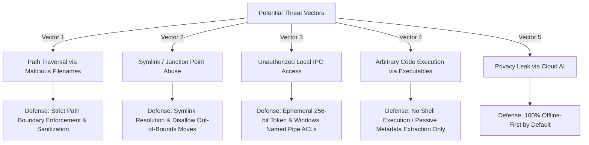

# FolderMate Security Architecture & Threat Model

## 1. Security Philosophy & Threat Model

FolderMate is designed with a **Zero-Trust Local Execution** model. Because the application interacts directly with Windows filesystem operations, handles arbitrary files, and automates desktop applications via COM, strict defensive controls are enforced.



---

## 2. Threat Mitigations & Defensive Controls

### 2.1. Path Traversal & Out-of-Bounds File Moves
**Threat**: A filename containing `../../Windows/System32/calc.exe` or crafted directory templates attempting to write files outside the designated organization root.

**Mitigations**:
1. **Strict Path Normalization**: All computed target paths are resolved via `path.resolve()` and verified to reside strictly within `config.organizationRoot`:
```typescript
import path from "path";

export function assertPathWithinRoot(targetPath: string, rootDir: string): void {
  const normalizedTarget = path.normalize(path.resolve(targetPath));
  const normalizedRoot = path.normalize(path.resolve(rootDir));

  if (!normalizedTarget.startsWith(normalizedRoot + path.sep) && normalizedTarget !== normalizedRoot) {
    throw new SecurityException(`Path Traversal Detected: ${targetPath} is outside ${rootDir}`);
  }
}
```
2. **Filename Token Sanitization**: All tokens (`{Client}`, `{Project}`, etc.) are sanitized against Windows directory separators (`/`, `\`) and illegal characters before template interpolation.

### 2.2. Symlink & Windows NTFS Junction Abuse
**Threat**: A malicious symlink or directory junction in the Inbox folder pointing to sensitive system locations (`C:\Windows`, `%USERPROFILE%\.ssh`).

**Mitigations**:
1. FolderMate uses `fs.lstat()` to inspect filesystem entries.
2. If an entry in the Inbox is identified as a symbolic link (`stats.isSymbolicLink()`) or reparse point/junction, it is **ignored and flagged in the Review Queue** rather than traversed or moved.

### 2.3. IPC Hijacking & Local Process Isolation
**Threat**: Another unprivileged local application or malware attempting to invoke FolderMate IPC to move, delete, or inspect private user files.

**Mitigations**:
1. **Windows Named Pipe Security Descriptor (DACL)**: The named pipe `\\.\pipe\foldermate-ipc` is created with a discretionary access control list granting access exclusively to the current user's Windows SID (`SecurityIdentifier`).
2. **Cryptographic Ephemeral Token**: On engine startup, a 256-bit token is generated with `crypto.randomBytes(32)` and saved to `%APPDATA%\FolderMate\.auth_token` with strict NTFS permissions (`icacls` granting `(F)` only to the current user).
3. **Handshake Verification**: Every IPC connection must transmit the auth token within 2000ms.

### 2.4. Arbitrary Executable Prevention
**Threat**: User drops `.exe`, `.bat`, `.cmd`, `.ps1`, or `.vbs` files into the Inbox.

**Mitigations**:
1. FolderMate **never executes files** via shell execution (`exec`, `spawn` with user files).
2. Executable extensions are classified passively as generic files or routed to a quarantined Review Queue bucket depending on user configuration.
3. COM automation is restricted exclusively to trusted target applications (CorelDRAW).

---

## 3. Privacy & Data Governance

| Principle | Enforcement Mechanism |
| :--- | :--- |
| **100% Offline-First by Default** | All classification, hashing, FTS5 indexing, and COM automation occur locally on the user's workstation. No internet connection is required. |
| **Zero Telemetry by Default** | No diagnostic telemetry or file metadata is transmitted to external servers without explicit opt-in. |
| **Cloud AI Privacy Guard** | If cloud AI classification is enabled in Phase 10: Only sanitized filename tokens and extracted text snippets (<500 characters) are transmitted; full binary documents are never uploaded. |
| **Encrypted Database Option** | Support for SQLCipher encryption with user-managed keys for sensitive enterprise installations. |
