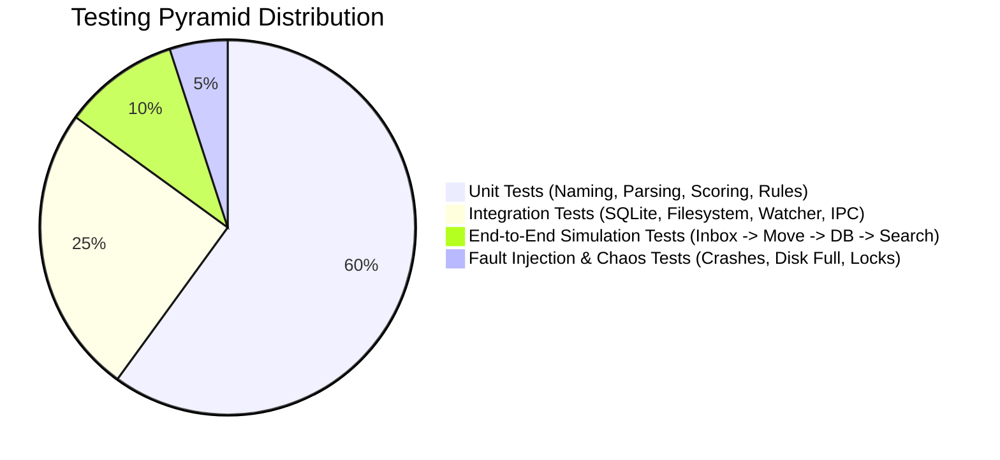
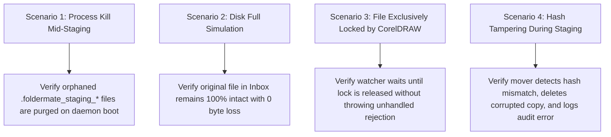

# FolderMate Testing Strategy & Quality Assurance

## 1. Testing Pyramid & QA Architecture

Because FolderMate handles user files and filesystem modifications, software testing must be exhaustive, deterministic, and include active fault injection.



---

## 2. Testing Levels & Tooling

| Test Level | Scope | Framework / Tools |
| :--- | :--- | :--- |
| **Unit Tests** | Template parser, version regex, confidence scorer, path sanitizer, token expansion | `Vitest` / `TypeScript` |
| **Integration Tests** | SQLite migrations, FTS5 sync, lock detector, two-phase file stager, IPC server | `Vitest` + In-memory / Temp filesystem |
| **COM Bridge Tests** | C# COM interop, CorelDRAW status extraction, mock COM server | `xUnit` + .NET 8 CLI |
| **E2E Simulation** | Complete lifecycle: Drop file in Inbox $\to$ Organize $\to$ Verify Disk & DB $\to$ Search | `Playwright` + Vitest Test Daemon |
| **Fault Injection** | Power kill simulation, `ENOSPC` disk full, `EBUSY` file locking, hash tampering | Custom Chaos Test Harness |

---

## 3. Unit Test Specifications

### 3.1. Parsing & Template Expansion Test Cases
```typescript
import { describe, it, expect } from "vitest";
import { parseVersionFromFilename } from "../src/versioning/parser";
import { sanitizeWindowsFilename } from "../src/organization/sanitizer";
import { evaluateConfidence } from "../src/classification/scorer";

describe("Version Parser", () => {
  it("extracts explicit canonical versions correctly", () => {
    expect(parseVersionFromFilename("id card v8").versionNumber).toBe(8);
    expect(parseVersionFromFilename("flyer_v02_final").versionNumber).toBe(2);
    expect(parseVersionFromFilename("catalog (ver 14)").versionNumber).toBe(14);
  });

  it("handles qualitative tokens as unassigned for DB lookup", () => {
    const result = parseVersionFromFilename("abc final latest");
    expect(result.versionNumber).toBeNull();
    expect(result.matchedToken).toBe("final");
    expect(result.confidence).toBeGreaterThanOrEqual(0.65);
  });
});

describe("Path & Filename Sanitizer", () => {
  it("strips illegal Windows characters", () => {
    expect(sanitizeWindowsFilename("ABC: School <ID> Card? *")).toBe("ABC- School -ID- Card- -");
  });

  it("handles reserved Windows device names safely", () => {
    expect(sanitizeWindowsFilename("CON.cdr")).toBe("_CON.cdr");
    expect(sanitizeWindowsFilename("NUL")).toBe("_NUL");
  });
});
```

---

## 4. Integration & Filesystem Testing

Integration tests use temporary sandbox directories (`os.tmpdir()/foldermate-test-XXXXXX`) to execute real filesystem and database operations:

```typescript
import { describe, it, expect, beforeEach, afterEach } from "vitest";
import fs from "fs-extra";
import path from "path";
import os from "os";
import { TwoPhaseMover } from "../src/organization/mover";
import { DatabaseManager } from "../src/database/manager";

describe("TwoPhaseMover Integration", () => {
  let tempDir: string;
  let inboxDir: string;
  let targetDir: string;
  let db: DatabaseManager;

  beforeEach(async () => {
    tempDir = await fs.mkdtemp(path.join(os.tmpdir(), "foldermate-test-"));
    inboxDir = path.join(tempDir, "Inbox");
    targetDir = path.join(tempDir, "Clients", "ABC School", "2026", "ID Card");
    await fs.ensureDir(inboxDir);
    db = new DatabaseManager(":memory:");
    await db.runMigrations();
  });

  afterEach(async () => {
    await db.close();
    await fs.remove(tempDir);
  });

  it("safely stages, verifies hash, and atomically moves file", async () => {
    const sourceFile = path.join(inboxDir, "test_design.cdr");
    await fs.writeFile(sourceFile, Buffer.from("CorelDRAW binary payload simulation"));

    const mover = new TwoPhaseMover(db);
    const result = await mover.executeMove({
      sourcePath: sourceFile,
      destinationFolder: targetDir,
      targetFilename: "ABC School ID Card 2026 v1.cdr"
    });

    expect(result.success).toBe(true);
    expect(await fs.pathExists(result.finalPath)).toBe(true);
    expect(await fs.pathExists(sourceFile)).toBe(false); // Original moved in direct mode
  });
});
```

---

## 5. Fault Injection & Chaos Testing Scenarios



### 5.1. Automated Chaos Runner
A dedicated script (`npm run test:chaos`) systematically triggers:
1. Forced process termination (`SIGKILL`) during Phase 1 staging.
2. Simulated disk quota exhaustion.
3. Concurrent file writes while stability check is executing.
4. Database file locking contention.
