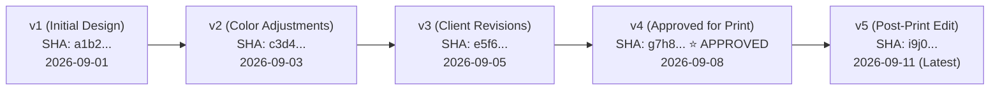

# FolderMate Version Engine & Lineage Architecture

## 1. Versioning Principles

In creative and document workflows, version numbers are frequently corrupted by messy ad-hoc suffixes:
- `id card final.cdr`
- `id card final final 2.cdr`
- `id card latest print ok.cdr`
- `id card v2 updated.cdr`

FolderMate replaces chaotic string suffixes with a **canonical integer version lineage ledger** stored in SQLite, while presenting clean, standardized names to the operating system (e.g. `ABC School ID Card 2026 v8.cdr`).

---

## 2. Version Detection & Token Parsing

The version parser normalizes raw filenames into canonical integer versions using a multi-pattern regex hierarchy:

```mermaid
graph TD
    Input[Raw Filename: 'id card final v03 updated.cdr'] --> P1{Explicit 'vN' / 'verN' Pattern?}
    P1 -- Yes (Matched 'v03') --> Canonical[Version = 3]
    P1 -- No --> P2{Semantic / Suffix Pattern?<br/>'final', 'latest', 'print ok'}
    P2 -- Yes --> Lookup[Query DB for Existing File Lineage]
    Lookup --> NextVer[Assign Next Version = Max(v) + 1]
    P2 -- No --> P3{No Version Marker}
    P3 --> FirstVer[Default Version = 1 or Increment Existing]
```

### 2.1. Version Extraction Hierarchy

```typescript
export interface ParsedVersionInfo {
  versionNumber: number | null;
  confidence: number;
  matchedToken: string | null;
  cleanedBaseName: string;
}

export const VERSION_PATTERNS = [
  // Explicit: v1, v02, v_3, ver.4, version 5, -v6
  {
    regex: /(?:^|[\s_\-.])(?:v|ver|version)[\s_.]*0*(\d+)(?:$|[\s_\-.])/i,
    confidence: 1.0,
  },
  // Parenthesized version: (v2), (3), [v4]
  {
    regex: /[\(\[]\s*(?:v|ver)?\s*0*(\d+)\s*[\)\]]/i,
    confidence: 0.95,
  },
  // Trailing digit after separator: project_02.cdr, flyer-3.pdf
  {
    regex: /[\s_\-]0*(\d+)$/i,
    confidence: 0.80,
  },
  // Qualitative tokens: final, latest, new, updated, print_ready
  {
    regex: /(?:^|[\s_\-.])(final|latest|new|updated|print[\s_\-]*ready|approved)(?:$|[\s_\-.])/i,
    confidence: 0.65,
    isQualitative: true,
  }
];

export function parseVersionFromFilename(filenameWithoutExt: string): ParsedVersionInfo {
  for (const pattern of VERSION_PATTERNS) {
    const match = filenameWithoutExt.match(pattern.regex);
    if (match) {
      if (pattern.isQualitative) {
        return {
          versionNumber: null, // Resolves against existing DB record
          confidence: pattern.confidence,
          matchedToken: match[1],
          cleanedBaseName: filenameWithoutExt.replace(pattern.regex, " ").trim(),
        };
      }
      return {
        versionNumber: parseInt(match[1], 10),
        confidence: pattern.confidence,
        matchedToken: match[0],
        cleanedBaseName: filenameWithoutExt.replace(pattern.regex, " ").trim(),
      };
    }
  }

  return {
    versionNumber: null,
    confidence: 0.0,
    matchedToken: null,
    cleanedBaseName: filenameWithoutExt,
  };
}
```

---

## 3. Version Lineage & Tree Graph

FolderMate models file versions as a directed acyclic graph (DAG) in `file_versions`. Each version points to its immediate parent:



### 3.1. Version States & Flags
- **`is_latest`**: Exactly one version per `file_id` has `is_latest = 1`. This corresponds to the active file residing at `current_path`.
- **`is_approved`**: Flags a milestone version (e.g. approved by client, sent to press). Approved versions are protected against accidental overwrites.
- **`parent_version_id`**: Foreign key establishing ancestral lineage.

---

## 4. Conflict Resolution & Collision Policies

When a new file is being organized into a destination where a version collision might occur:

```mermaid
flowchart TD
    Start[Organize File: 'ABC School ID Card 2026 v8.cdr'] --> CheckTarget{Does Target File Exist on Disk?}
    
    CheckTarget -- No --> DirectWrite[Save as v8 -> DB Commit]
    CheckTarget -- Yes --> CompareHash{Is Target Hash == Source Hash?}
    
    CompareHash -- Yes (Exact Duplicate) --> Supress[Suppress Duplicate Move<br/>Log Event: DUPLICATE_VERSION_DETECTED]
    CompareHash -- No (New Content) --> CheckPolicy{Check Configured Collision Policy}
    
    CheckPolicy -- Auto-Increment (Default) --> CalcNext[Query DB for MAX(version_number)<br/>Assign v = Max + 1 (v9)]
    CalcNext --> StageMove[Stage & Atomic Move as v9]
    
    CheckPolicy -- Prompt User --> Queue[Move to Review Queue<br/>Reason: 'Version 8 already exists with different content']
```

### 4.1. Configurable Collision Policies
1. **`AUTO_INCREMENT` (Recommended Default)**: If `v8` exists with different content, automatically promote new file to `v9`.
2. **`PROMPT_REVIEW`**: Places the collision into the Review Queue, allowing the user to choose:
   - *Overwrite existing version* (archives old version to `.history/`).
   - *Increment to next version*.
   - *Save as minor branch* (e.g. `v8.1` or `v8-Alt`).
3. **`CREATE_BRANCH`**: Creates an alternate lineage branch for client concept variations.

---

## 5. Version Restoration Protocol

Users can restore any historical version directly from the Electron UI:

1. **User selects historical version** (e.g. `v4`).
2. **Safety Snapshot**: The current `v8` is confirmed archived in historical storage.
3. **Restoration Action**:
   - The engine copies the `v4` payload to `<Destination>/ABC School ID Card 2026 v9.cdr` (promoting it as a new forward version `v9` with `change_summary = "Restored from v4"`).
   - Alternatively, in *In-Place Reversion Mode*, `v4` replaces `current_path`, and `file_versions` updates `is_latest = 1` for `v4`.
4. **Audit Log**: Appends a `RESTORED` event in `file_events`.
